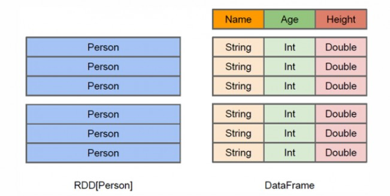

# RDD 和 DataFrame 的区别

RDD 是弹性分布式数据集，其本质是 Dataset。Dataset 可以从 JVM 对象中构建 （例如 rating 对象，即 javabean ），然后通过 map、flatMap、filter 等方法转换来操作。

为了更好地读写数据以及使用类似SQL语句一样简单地操作，Spark SQL 提供了 DataFrame (其前身是SchemaRDD)。


DataFrame 能够让你知道数据集中的每一行和列。这个概念跟关系型数据库中的表（table）类似，但是比表更强大。如下图：




DataFrame 可以从结构化的数据文件（structured data files）、Hive中的表、外部数据库或者**已存在的RDD**中构建。

在 Java 中，使用 `Dataset<Row>` 来表示 DataFrame。

<!-- more -->

---

# Getting Started

## 初始化 Spark

```java
SparkSession spark = SparkSession
  .builder()
  .appName("Java Spark SQL basic example")
  .config("spark.some.config.option", "some-value")
  .getOrCreate();
```

## 创建 DataFrames

通过 SparkSession，可以从已存在的RDD、Hive表、或者[其他数据源](https://spark.apache.org/docs/latest/sql-programming-guide.html#data-sources) 来创建DataFrames

例如，从一个 json 文件创建 DataFrames：

```java
Dataset<Row> df = spark.read().json("examples/src/main/resources/people.json");

// Displays the content of the DataFrame to stdout
df.show();
// +----+-------+
// | age|   name|
// +----+-------+
// |null|Michael|
// |  30|   Andy|
// |  19| Justin|
// +----+-------+
```

## 操作 DataFrame

`df`可以像数据库表一样进行操作：

- `df.printSchema()`：打印DataFrames结构
- `df.select("name").show()`: 选择 name 列打印
- `df.filter(col("age").gt(21)).show()`：筛选出年龄列大于21的
- `df.groupBy("age").count().show()`：统计各年龄人数

或者，把它变成一张临时的表

```java
// Register the DataFrame as a SQL temporary view
df.createOrReplaceTempView("people");
```

现在，我们的内存里就存在一张临时 people 表了。然后通过 Spark SQL 来操作：

```java
Dataset<Row> sqlDF = spark.sql("SELECT * FROM people");
    sqlDF.show();
    // +----+-------+
    // | age|   name|
    // +----+-------+
    // |null|Michael|
    // |  30|   Andy|
    // |  19| Justin|
    // +----+-------+
```

`df.createOrReplaceTempView("people")`的生命周期在 Spark Session，Session一关闭临时表就不存在了。如果要用应用程序级别的全局临时表，使用`df.createGlobalTempView("people")`，使用全局表需要在SQL语句添加 `.global_temp`

```java
df.createGlobalTempView("people");

// Global temporary view is tied to a system preserved database `global_temp`
spark.sql("SELECT * FROM global_temp.people").show();
```

---

# 一个agg的例子

从数据库读一张表，然后根据相同的 userId，将 productId 聚合为 List

```
// 转换前
+------+---------+
|userId|productId|
+------+---------+
|     3|  1786670|
|     3|  2679073|
|     3|  1082387|
|     8|  1082734|
|     9|  4039416|
|     9|  1734231|
|     1|  5252677|
|    10|  1141406|
|    10|  1026425|
|    10|  3426048|
|     1|  1193101|
|     1|  1051440|
+------+---------+


//转换后
+------+--------------------+
|userId|          productIds|
+------+--------------------+
|     1|[5252677, 1193101...|
|     3|[1056461, 1786670...|
|     9|[1734231, 4039416]  |
|     8|[1082734]           |
|    10|[1141406, 3426048...|
+------+--------------------+
```

方法：

```scala
val dataset = MySQLUtils
                .readFromMySQL(spark, "likes")
                .select("userId", "productId")

dataset.show()

val dataFormat = dataset
                .groupBy("userId")
                .agg(collect_set("productId") as "productIds")

dataFormat.show()
```


- groupBy 以 userId， 将一个 dataframe 分成多个， 然后 agg 将多个 DataFrame 聚合， 聚合的参数是 collect_set("productId") 。

---

更多操作见：

- [官方文档](https://spark.apache.org/docs/latest/sql-programming-guide.html#datasets-and-dataframes)
- [官方示例](https://github.com/apache/spark/blob/master/examples/src/main/java/org/apache/spark/examples/sql/JavaSparkSQLExample.java)


---

# DataFrame 的函数

## Action 操作
1、 collect() ,返回值是一个数组，返回dataframe集合所有的行
2、 collectAsList() 返回值是一个Java类型的数组，返回dataframe集合所有的行
3、 count() 返回一个number类型的，返回dataframe集合的行数
4、 describe(cols: String*) 返回一个通过数学计算的类表值(count, mean, stddev, min, and max)，这个可以传多个参数，中间用逗号分隔，如果有字段为空，那么不参与运算，只这对数值类型的字段。例如df.describe("age", "height").show()
5、 first() 返回第一行 ，类型是row类型
6、 head() 返回第一行 ，类型是row类型
7、 head(n:Int)返回n行  ，类型是row 类型
8、 show()返回dataframe集合的值 默认是20行，返回类型是unit
9、 show(n:Int)返回n行，，返回值类型是unit
10、 table(n:Int) 返回n行  ，类型是row 类型

## dataframe的基本操作

1、 cache()同步数据的内存
2、 columns 返回一个string类型的数组，返回值是所有列的名字
3、 dtypes返回一个string类型的二维数组，返回值是所有列的名字以及类型
4、 explan()打印执行计划  物理的
5、 explain(n:Boolean) 输入值为 false 或者true ，返回值是unit  默认是false ，如果输入true 将会打印 逻辑的和物理的
6、 isLocal 返回值是Boolean类型，如果允许模式是local返回true 否则返回false
7、 persist(newlevel:StorageLevel) 返回一个dataframe.this.type 输入存储模型类型
8、 printSchema() 打印出字段名称和类型 按照树状结构来打印
9、 registerTempTable(tablename:String) 返回Unit ，将df的对象只放在一张表里面，这个表随着对象的删除而删除了
10、 schema 返回structType 类型，将字段名称和类型按照结构体类型返回
11、 toDF()返回一个新的dataframe类型的
12、 toDF(colnames：String*)将参数中的几个字段返回一个新的dataframe类型的，
13、 unpersist() 返回dataframe.this.type 类型，去除模式中的数据
14、 unpersist(blocking:Boolean)返回dataframe.this.type类型 true 和unpersist是一样的作用false 是去除RDD

## 集成查询

1、 agg(expers:column*) 返回dataframe类型 ，同数学计算求值
df.agg(max("age"), avg("salary"))
df.groupBy().agg(max("age"), avg("salary"))
2、 agg(exprs: Map[String, String])  返回dataframe类型 ，同数学计算求值 map类型的
df.agg(Map("age" -> "max", "salary" -> "avg"))
df.groupBy().agg(Map("age" -> "max", "salary" -> "avg"))
3、 agg(aggExpr: (String, String), aggExprs: (String, String)\*)  返回dataframe类型 ，同数学计算求值
df.agg(Map("age" -> "max", "salary" -> "avg"))
df.groupBy().agg(Map("age" -> "max", "salary" -> "avg"))
4、 apply(colName: String) 返回column类型，捕获输入进去列的对象
5、 as(alias: String) 返回一个新的dataframe类型，就是原来的一个别名
6、 col(colName: String)  返回column类型，捕获输入进去列的对象
7、 cube(col1: String, cols: String*) 返回一个GroupedData类型，根据某些字段来汇总
8、 distinct 去重 返回一个dataframe类型
9、 drop(col: Column) 删除某列 返回dataframe类型
10、 dropDuplicates(colNames: Array[String]) 删除相同的列 返回一个dataframe
11、 except(other: DataFrame) 返回一个dataframe，返回在当前集合存在的在其他集合不存在的
12、 explode[A, B](inputColumn: String, outputColumn: String)(f: (A) ⇒ TraversableOnce[B])(implicit arg0: scala.reflect.api.JavaUniverse.TypeTag[B]) 返回值是dataframe类型，这个 将一个字段进行更多行的拆分
df.explode("name","names") {name :String=> name.split(" ")}.show();
将name字段根据空格来拆分，拆分的字段放在names里面
13、 filter(conditionExpr: String): 刷选部分数据，返回dataframe类型 df.filter("age>10").show();  df.filter(df("age")>10).show();   df.where(df("age")>10).show(); 都可以
14、 groupBy(col1: String, cols: String*) 根据某写字段来汇总返回groupedate类型   df.groupBy("age").agg(Map("age" ->"count")).show();df.groupBy("age").avg().show();都可以
15、 intersect(other: DataFrame) 返回一个dataframe，在2个dataframe都存在的元素
16、 join(right: DataFrame, joinExprs: Column, joinType: String)
一个是关联的dataframe，第二个关联的条件，第三个关联的类型：inner, outer, left_outer, right_outer, leftsemi
df.join(ds,df("name")===ds("name") and  df("age")===ds("age"),"outer").show();
17、 limit(n: Int) 返回dataframe类型  去n 条数据出来
18、 na: DataFrameNaFunctions ，可以调用dataframenafunctions的功能区做过滤 df.na.drop().show(); 删除为空的行
19、 orderBy(sortExprs: Column*) 做alise排序
20、 select(cols:string*) dataframe 做字段的刷选 df.select($"colA", $"colB" + 1)
21、 selectExpr(exprs: String*) 做字段的刷选 df.selectExpr("name","name as names","upper(name)","age+1").show();
22、 sort(sortExprs: Column*) 排序 df.sort(df("age").desc).show(); 默认是asc
23、 unionAll(other:Dataframe) 合并 df.unionAll(ds).show();
24、 withColumnRenamed(existingName: String, newName: String) 修改列表 df.withColumnRenamed("name","names").show();
25、 withColumn(colName: String, col: Column) 增加一列 df.withColumn("aa",df("name")).show();
