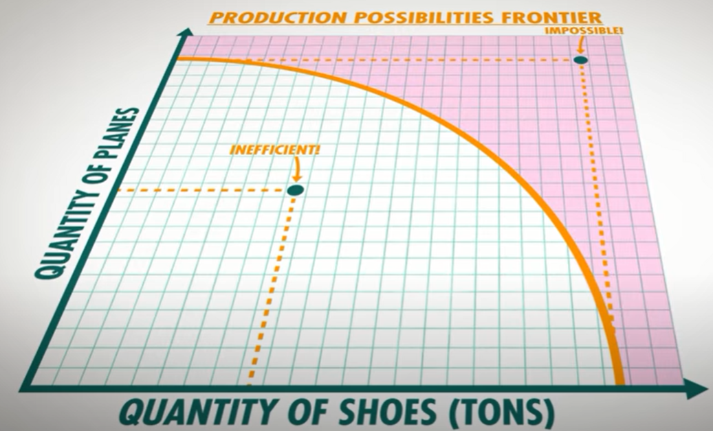
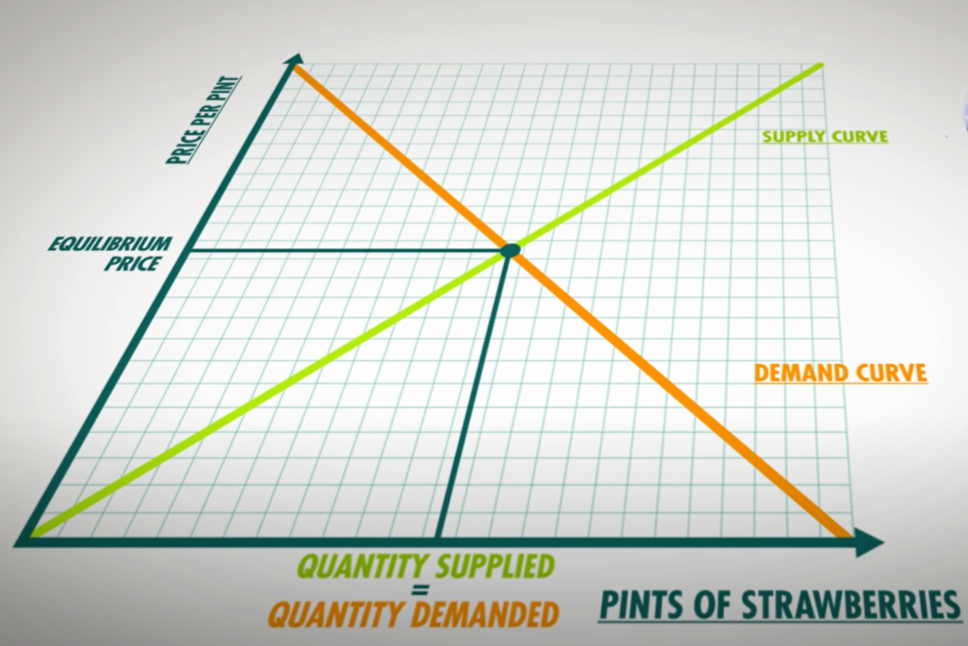

之前看过《Crash Course Computer Science》课程，觉得非常不错，后来发现 Crash Course 竟然是一个系列，涵盖了物理、工程、生物、经济、历史等各个学科，在 Youtube、B站、网易公开课都能免费看，这还不赶紧学起来？本次挑了经济学系列来学习，算是跨越我的专业和行业了，能收获到多少呢？我也很期待。

<!-- more -->

课程地址：

- [油管英文原版](https://www.youtube.com/watch?v=3ez10ADR_gM&list=PL1oDmcs0xTD-dJN1PL2N1urX0EKupBJCQ&index=1)
- [网易云中文字幕](https://open.163.com/newview/movie/free?pid=MBGQ1VONR&mid=MBGQ259M4)

> PS. 网易缺少了第二集，需要到 B站 或 Youtube 看

---

# P1 经济学简介

经济学不是研究金钱、致富、股票、市场的科学，而是研究 **人与决策** 的科学。经济学关乎个人、公司、政府如何决策。事实上，当你正在阅读这篇文字，你也正是在运用经济学，阅读这篇文字本身花费了你的成本——你本可以去读读小说、刷刷微博，但你没有，而是选择了阅读本文，这叫做 **机会成本**，因为你知道阅读本文是当下收益和成本最划算的选择，去做其他事情，要么收益太低，要么成本太高。

经济学中有两个最重要的假设，第一是 **资源稀缺**，第二是 **任何事情都是有成本的**。我们不断决策，从有限的资源中获得最大的收益。

我们经常会说政策如何影响自由市场经济，其实政府也是利用经济学原理来发布政策，而调整政策主要靠的是 **数据支撑理论** 和 **找到正确的激励方法**。

经济学分为 **宏观经济学** 和 **微观经济学** 。宏观经济学研究经济整体，关注整个国家的产出、失业、通货膨胀、利率、政府开销、经济增长等，但只有不到一半的经济学家研究这玩意，更多经济学家他们研究的是微观经济学——公司雇佣多少员工才能利润最大化？发布新产品的最佳时期？

> 每制造一支枪，每下水一艘战舰，每发射一枚火箭，所有这些都是从那些饥饿却没有东西吃、寒冷却没有衣服穿的人那里偷窃来的。军火的世界不仅仅用掉了金钱，还榨干了工人的汗水，科学家的天才，和孩子们的希望。 —— 美国总统 Dwight D. Eisenhower 

---

# P2 专业与贸易化

世界上第一位现代经济学家 Adam Smith 写了一本书叫《国富论》，书中透彻地解释了国家繁荣的两个原因 —— **专业化** 和 **贸易交换**。专业化也叫做劳动分工，擅长做披萨的人可以专门做披萨，擅长做T恤的人可以专门做T恤，这使得人们的生产效率更高。但是，让人们更富裕的还是贸易交换。擅长做披萨的人和擅长做T恤的人，通过交易互换，能获得更多的披萨和T恤。

在经济学中，有一个著名的图表，叫 **生产可能性边界（PPF）**，它阐述了两种商品的生产之间若存在权衡关系，应该如何获得利益最大化。因为资源是有限的，一件商品生产多了，势必会导致另一件商品生产少。

总而言之，无论是个体还是国家，都应该专门生产具有相对优势的商品，然后与其他人交换对方的相对优势商品，这种贸易是互利双赢的。当然，生产可能性边界只是经济学中最简单的一个模型，现实情况要复杂得多，但思想却是不变的。

---

# P3 经济体系

因为资源是有限的，在生产中，我们必须搞清楚三件事：1. 生产什么 2. 如何生产 3. 谁获得产品

当今社会有两种主流的经济体系，分别是 **计划经济** 和 **市场经济** 。两种体系归根结底回答的都是“谁拥有和控制生产要素”的问题。马克思把生产要素划分为土地、劳动力和资本，并写了一本书叫《资本论》。当政府控制生产要素，政府可以决定生产什么，如何生产，谁获得产品，像这种经济完全受到政府的控制的体系，就称为计划经济。反过来，如果个体拥有生产要素，政府对生产、贸易、商务采取放任自由的态度，就称为自由市场经济。

两种经济体系各有优劣，没有绝对好坏。例如，市场经济的供需是完全由市场决定的，稀缺的资源会用于最迫切的需求，企业会敏锐地察觉消费市场的变化，生产消费者更愿意买的东西，不同企业之间的产品优胜劣汰，形成竞争。而这如果放在计划经济里，政府对生产内容是提前计划好的，对消费市场的变化，往往不能很快做出反应，生产效率一般也不会很高。但另一些方面，像维护法制、公共设施和服务这些，是必须由政府来主导的，市场经济在这些领域就完全行不通了。此外，市场经济是容易出错的，他们可以为了逐利牺牲公共环境、自然保护、甚至压榨工人等等，这些时候往往也需要政府介入干预。

**现代国家的经济体系中，通常都是混合经济体系**。政府往往不会干预企业生产什么汽车、如何生产，但会限制企业的生产汽车需要符合哪些环保标准，以及付给工人的最低工资标准等等。

**循环流动图** 很好地阐述了混合经济，在这个图中，描述了产品、资源、金钱 在 家庭、企业、政府 的参与下循环流动。

> 经济学没有解决方案，只有权衡取舍（trace-off） —— 经济学家 Thomas Sowell 

---

# P4 供给与需求

 市场是买卖双方交换商品和服务的地方，其关键在于自愿交换。市场是无处不在的，各种市场的交换不断连锁，最终形成商品生产链。经济学家把市场产生的指导资源分配的信息称为 **价格信号**，一件商品价格高了，买的人少了，卖方只能减产降价，一减产降价，买的人又多起来了，又会促使卖方增产涨价，直至达到平衡，这就是 **供给和需求**。

 事实上，所有商品的价格无时不刻都在变化，外部力量会使供给曲线和需求曲线发生平移，改变均衡价格和均衡数量。在市场中，只会发生四件事：供给增加、供给减少、需求增加、需求减少。因为是自愿交换，所以价格的存在是有原因的。

 然而，需求与供给模型并不适用于所有市场。例如，消防、医疗、人体器官等。想象一下，穷人因为觉得1万元的价值超过了自己的肾，于是去卖肾，变相减少寿命，而富人可以用钱买到器官从而活得更久，这既不公平也不道德。在这些方面，市场的存在或许可以解决一些问题，但想要有一个良好的市场环境，这些市场必须要受到 **监管**。

 ---

 # P5 宏观经济

 宏观经济是研究整体经济的科学，如经济产出、失业、通货膨胀、利率、政策等等。宏观经济学家根据数据、理论模型和历史趋势进行预测，因为经济学属于社会科学，研究的是人，所以不同的经济学家预测的结果也可能大相径庭。

 一般来说，国家的经济政策有三个目标 1. 维持经济持续增长 2. 控制失业 3. 维持价格稳定 ，大多数时候当这三个目标达成时，人民会更幸福。经济学家用三个特殊的指标来描述一个国家是否达到了每个目标。分别是 **国内生产总值（Gross Domestic Product，GDP）**、**失业率（unemployment）**、**通货膨胀率（inflation rate）**。

 GDP是一段时间内一个国家境内所有最终产品和服务的价值，但不包括二手产品、金融资产、企业收购等，因为没有新的产品或服务制造出来，也不包括非法交易、家庭生产等。GDP是以美元来衡量的，但因每个国家的通货膨胀不一样，所以 GDP 分为 名义GDP 和 真实GDP，真实GDP已经把通货膨胀的影响去掉了，所以更加真实，也被更多人认可。当然，不同国家的 GDP 计算方式可能略有差异，总的来说，GDP的发明是为了核算国民收入，但可能不会完整地反映国家经济的状态，但至少是一种衡量经济增长的方式。

 失业的衡量指标是失业率，用 失业人数 除以 劳动力人口数 就得到了失业率。这里的失业人数，指的是积极在寻找工作但却找不到的人，因此要把小孩、老人、无法工作者、不找工作者剔除。经济学家认为有 3 种类型的失业，分别是 **摩擦性失业**（跳槽、换工作过程中的空档期）、**结构性失业**（市场不再需要特定类型的工人） 和 **周期性失业**（经济衰退引起的失业），前两种是比较正常的，但最后一种就得重点关注和控制了。

 价格稳定的衡量指标是通货膨胀率。我们的目标是维持价格稳定，是的，价格上涨和下降都不是好事。价格上涨意味着 **通货膨胀**，同样的钱能买到的东西变少了，而价格下降意味着 **通货紧缩**，人们会期待商品价格更便宜而不进行消费，进而导致 GDP 下降，失业率增加，变成恶性循环。

 一般来说，经济的增长和衰退，都是伴随着一定的周期的，这叫做商业周期。政府可以通过调整消费和税收等方式来调控。以上，就是经济的运作和衡量的方式。

 ---

 # P6 生产力与增长

**人均GDP** 用来衡量一个国家的富有程度以及人民的生活水平。联合国用 **人类发展指数（HDI）** 衡量世界各国人民的平均寿命、文化程度、教育程度、生活质量，发现人均GDP高的国家有更低的婴儿死亡率、贫穷和可预防疾病。

有些国家之所以富有，是因为他们的 **生产力** 高。但是生产力本身有一定的局限性，有些保障性的东西，更需要高生产力，例如食物、衣物、房屋、洁净的水、医药等，能用更少资源生产更多这些东西的国家，人民会更富有，更健康和更幸福。那么，是什么让一些国家的生产力高于其他国家呢？生产产品需要的成分，经济学家称为 **生产要素**，土地等自然资源，工人等劳动力资源，机器、工厂等基础设施资本，工人生产产品所需要的知识和技能等人力资本，这些都是生产要素。学校其实就是培养人力资本的地方。

资源的质量和数量，只是生产力发达的第一步，更重要的是如何使用这些东西。增加资源是有成本的，但是同样的资源，可以换一种更优的方式来组织生产。经济学家把组织的有效性叫做 **技术**。可以说，拥有资本和技术，就拥有了生产力。

---

# P7 通货膨胀和泡沫

衡量一个国家的整体物价水平，即通货膨胀情况，可以用 **消费者物价指数（CPI）**。CPI 是什么呢？我们知道，物价会影响我们的购买力，但每一年的物价都是不一样的，几十年前的一根雪糕才几分钱，而现在要几块钱，所以，为了让每一年的物价可以比较，需要进行通货膨胀校正。经济学家会挑选一系列代表消费者每年会购买的商品，称为消费者购物篮，每一年篮子里的总价格就代表物价水平。通过每一年总价格的横向比较，我们就能测量和预估通货膨胀水平。但是 CPI 不能计算新产品或不同年份的商品质量差异，所以还需要有一些 **调整因素** 来同时考虑技术进步。

引起通货膨胀的一个原因是 **需求**，太多钱追赶着太少的商品，以至于把商品的价格抬高了。另一个原因是 **成本**，也就是重要生产资源的减少，例如石油减少了引起油价上涨，引起运输成本上涨，紧接着又引起所有商品的成本上涨，这种现象叫 **供给冲击**。简单地说，通货膨胀是钱太多，商品或服务太少的结果。

有人说，通货膨胀是供给和需求的变化导致的，实际上不一定，因为供给和需求很难解释房价的上涨，有时候人口没有突然增长，建筑材料也没有涨价，但是房子却变贵了，这是因为较低的利率和欺骗性的借贷行为鼓励更多的人买房子，增加了需求，抬高了房价，之后人们看到房价上涨，觉得房价还会继续涨，于是为了投资获利，不惜一切砸锅卖铁买房子，这种投机行为又带动了房价的进一步上涨。这就是 **价格泡沫**。

泡沫依赖于一个不断增加的买方供给量，但最终假设没有人接盘了，泡沫就会随之破碎。二十年前的互联网，如今的房价，谁能说里面到底有多少泡沫呢？

---

# P8 财政政策

高通货膨胀带来的高消费榨干了人民的存款，是人民抗议和动乱的根源。所以执政者应该干预宏观经济，推动充分就业，降低通货膨胀。**财政政策就是用来校正通货膨胀的方法**。

财政政策的思想很简单，当经济下降进入 **衰退缺口** 时，政府可以通过提高政府支出，减少税收来缓解，这叫做 **扩张性财政政策**。背后的原理其实也很简单，政府提高支出（创造工作岗位，提高劳动者收入）和减少税收，劳动者就有了更多的可支配收入，从而提高消费，促进经济增长。反过来，当经济指数过高，进入 **通货膨胀缺口** 时，政府可以减少支出，提高税收，抑制消费，这叫做 **紧缩性财政政策**，虽然这并不很常见。 

财政政策是否真的对促进经济增长有效，这是现代经济学中最激烈的辩论。支持财政政策刺激消费的一派，叫**凯恩斯派别**。反对凯恩斯的人觉得，有些政策可能会适得其反，因为政府为了刺激经济提高财政支出，这部分钱是需要政府来买单的，于是就会出现财政赤字，也就是政府会负债。支持凯恩斯的人觉得，当经济下行时，财政政策至少给劳动者和企业带来了信心，这总比什么都不干要强。

当政府给劳动者额外支出100元，劳动者拿其中的50元去听演唱会，歌手拿这50元花掉其中的25元。于是政府最开始100元的变成了实际价值175元的经济支出。这叫做 1.75 的乘数。作为执政者，要找到既能快速影响经济，又有较高的乘数的政策。减少税收确实能快速影响经济，但可能不是最优的，因为劳动者可能把钱存下来，而不是去消费。而雇佣工人修路，做基建，就有很高的乘数，但却可能要花费几年的时间。

---

# P9 赤字与负债

很多人可能会搞混赤字与负债，**赤字是一年中政府支出超过了税收收入，政府得借钱来填补短缺，负债是每一年赤字的积累**。美国有着全世界最高的负债，但美国似乎一点也不慌，因为美国虽然欠得多，但是但他还钱的能力更高。所以我们用 GDP百分比（负债/GDP） 来衡量一个国家的负债情况。那么是什么引起了巨大的赤字呢？比起税收的减少，其实支出才是占大头，政府支出有一大部分都在了社会保障了，比如养老、医保，还有部分用在了国防、扶贫等。

大多数人担心的不是美国已经借的这么多钱，而是担心他们还会继续借更多的钱。第一，政府把大部分的钱从债主那里借走了，企业能借的钱就少了，长远看对经济增长是不利的。第二，他们担心 **希腊困境**，政府借了太多的钱，债主会担心他还不上，因此提高利率，提高利率借主就更还不上钱了，导致更高的负债，最终导致违约，债主失去财产，政府失去信用，引起大规模的经济衰退。好在美国拥有债务天花板，规定了美国可以发行债券的上限。

然而，负债来自不断的赤字，赤字来自于花出去的钱比收入多，所以即使有债务天花板，仍然应该好好通过减少支出或提高收入来还钱，不然也是无济于事的。好在，大多数借钱给政府的人，都给予了一个比较低的利率，说明大家对政府还是充满信心的。

---

# P10 货币政策

美国有美联储，欧洲有欧洲中央银行，中国有中国人民银行，这些都是各个国家的中央银行。中央银行主要的作用是调控和监管国家的商业银行以及实施货币政策，**所谓货币政策，就是增加或减少货币供给来加速或放慢整体经济。**

## 改变货币供给来操控利率

当我们借钱出去时，往往会收取本金的一定百分比的金额作为收益，这个百分比叫做 **利率**。利率低时，人们愿意借更多的钱，而利率高时，人们借得少，花得更少。中央银行通过改变 **货币供给** 来操控利率。货币供给多时，银行有更多的钱可以出借，于是利率会降低，货币供给少时，银行没钱出借了，于是利率会调高。

如果中央银行想要加快经济，它可以增加货币供给，让银行降低利率，引起更多的借钱和花钱，这叫做 **扩张性货币政策**。相反，如果中央银行想要放慢经济，它就会降低货币供给，银行增加利率，减少消费，这叫做 **紧缩性货币政策**。紧缩性货币政策虽然可以减缓通货膨胀，但会增加失业率，所以有利有弊。

## 调控货币供给的方式

保持银行体系健康的有两件事，**信心** 和 **流动性**。信心是你要让储户将钱存进去之后，有信心可以取出来，流动性是银行要有储备的现金流，以免银行无钱可取。

在美国，调控货币供给有三种主要方式。

1. **改变法定准备金**：即改变银行保留的用户存款金额，减少法定准备金可以增加货币供给；
2. **改变商业银行的利率**：减少贴现率会使得银行更容易从美联储借钱，就可以增加货币供给；
3. **打开市场操作**：美联储可以从商业银行那里购买政府债券，来增加银行的流动性，从而增加货币供给，当然，也可以发行债券。

2008年经济危机来临时，美联储就购买了大量的债券，增加货币供给，降低利率到几乎为零，来促进经济，甚至罕见地实施了 **定量宽松（Q.E.）** ，即买光银行更长期的资产，例如房贷等。有人担心中央银行通过印钞机的钱大量购买债券和银行资产，使大量钞票进入经济系统，导致物价上涨。但实际上美国的通货膨胀率还算稳定，因为2008年之后，银行留了更多的准备金，没有借出去。 

## 货币政策vs财政政策

许多经济学家认为，普通的经济波动，货币政策会更有效，但在经济严重下滑时，财政政策可能要有效得多。