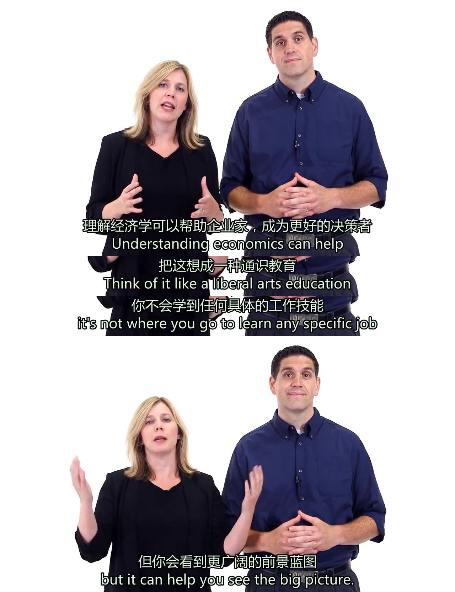

# P21 市场失灵

**当仅仅靠市场不能提供某些东西时，就叫做市场失灵**。这些东西通常称之为公共物品，一般是由政府出资，为了集体利益而建设的保障，如消防设施、学校、国防等。具有非排他性和非竞争性的特征。

<!-- more -->

## 公地悲剧

**公地悲剧是指每个人都能获得的公共物品经常被剥削和滥用**。人类「获得对自己最有利的，而不是对每个人最有利的」的想法，是导致 **公地悲剧（the Tragedy of the Commons）** 的根本原因。国家为什么要设置休渔期？如果不设置，海洋鱼群资源会被渔民无尽地捕捞，没有人愿意等待鱼产卵。热带雨林消失、濒危动物灭绝等也是一样的道理。经济学中有一个专门研究这个问题的分支，叫环境经济学。

## 外部性

无监管的市场，有时候并不能提供社会需要的结果。市场有可能会错误配置资源，因为它们没有获得正确的价格信号。**经济学中有个名词叫 外部性（Externalities），包括负外部性和正外部性，指的是外部成本和外部收益**。

例如一个工厂根据工人、原料等成本来生产商品，但是它没有考虑到污水排放会污染河流，导致鱼群死亡和饮用水污染等后果，这就是外部成本，并且这些成本由下游其他人在承受，而非工厂自身。自由市场假设成本都涵盖在商品里，但是很明显，工厂并不会去考虑外部成本，导致的后果就是市场失灵。这就是负外部性。

教育是正外部性的体现，它带来外部收益。你的受教育程度越高，你就越有可能变成一个积极多产的社会成员，你的工资越高，政府获得的税收就会更多。

## 解决方案

政府通常用 **管制政策** 或 **以市场为基础的政策** 来纠正外部性，校正市场失灵。

1. **管制负外部性**：通过禁止工厂使用某些化学品，或者限制工厂产量，或者监控工厂倒入河流的物质；
2. **管控正外部性**：通过强制义务教育提高全民教育水平。
3. **用税收和补贴操控市场、价格和激励**：通过对香烟收取高税收，拉高价格，消费者就会少买香烟。

全球化的今天，如果一个国家努力在纠正外部性，但是其他国家不那么做，也是一种公地悲剧。因此，像全球气候变化、人权问题、核武器扩散等，需要国家与国家的合作，信任和承诺。

---

# P22 环境经济学

## 污染和治理

 有人类存在的地方就会有污染，这是必然的。二氧化碳排放造成的全球气候变化，那么如何减少新增污染物排入大气层呢？在经济学家看来只需要两步：
 
1. 确认主要空气污染的来源（化石燃料、石油和煤）
2. 减少这些技术和产品的供应，或减少它们的需求

然而这实际执行起来却非易事，因为减少供应不是一个国家的事情，如果一个国家减少了其他国家还是在增加使用，就是公地悲剧，所以减少供应不现实。那么减少需求呢？一个思路是使用新能源，但是新能源目前的成本比较高，很难取代现有的能源体系。所以要么我们坐等新能源技术成熟，要么通过政府补贴、税收、管制、操控市场来加速这个过程。

**污染代表了市场失灵，因为污染本质上是负外部性**，所以部分经济学家认为政府干预是正当且必要的。政府要么出台政策管制企业排污量，要么提供价格激励，例如提高购买汽油的税收，或给开电动车的人发补贴。

政府也可以给部分企业颁发污染许可证，许可证的总数量有限，但企业之间可以转让，这叫做 **总量管制和交易制度**，或者也可以给特定的技术或企业（如风能、太阳能相关）补贴。

## 高效利用和回弹效应

当然，短时间内人类还摆脱不了化石能源，但我们可以更有效地利用这些资源，发展能源节约技术。但是也有经济学家提出了 **回弹效应**。例如从普通汽车换到高效燃油汽车后，节省下来的燃油费，消费者可能会拿去旅游或干别的，导致了更多的消耗，又或者，高效燃油汽车使得开车加油不再昂贵，于是大家都去买车，开车的人多了，整体汽油使用量实际并没有减少。

## 国际合作

国际社会已经努力了数十年一起合作保护环境，而中国也正在领导世界可再生能源的投资。但是作为普通人，我们要知道，不仅仅是政府和企业需要改变，消费者同样要行动，要更有意识地节约和消费。

---

# P23 教育经济学

几乎所有的国家都要求公民接受一定程度的免费义务教育。教育是正外部性，对个体和社会都是有益的，广泛的教育提高生产力、GDP和生活水平。为了公平，教育这件事只能由政府来做，如果教育完全私有化，会有一些人被排除在外，无法接受教育，那么整个社会变得更糟糕。

美国在教育体系上面花了大量的钱，包括支付中小学的公共教育费用和补贴大学教育，但是其最大的问题就是不平等，高收入家庭的学生往往受教育效果更佳。使教育更公平，不同的经济学家有不同的观点，包括：

1. 赞助，向弱势群体和低收入家庭的学生提供额外资助；
2. 设立教育券，学校之间竞争，学生可以自由选择学校，学校要么进步，要么失去政府赞助；
3. 出台激励政策激励教师，鼓励教师提高学生的表现。

促进教育公平的第一步，是投资中小学教育。那么大学值得投资吗？数据显示，大学生的平均工资比高中生更高，失业率更低，很显然，大学值得读。但是大学生挣得多也不一定是因为他上了大学，也与生活成长环境有关。经济学家提出两个观点来解释为什么大学毕业生挣钱多，第一是 **人力资本理论**，就是说大学实际上是教授技能，而你通过技能挣钱，第二是 **信号传递理论**，大学文凭就是聪明人的信号，它传递出你的经济地位和背景。

那么大学的成本代价是什么呢？可以说读大学的费用极其昂贵，大多数家庭难以承担，在美国大多数学生申请贷款来支付学费，而在中国公立大学的大部分费用有政府财政补贴。而那些没有渠道或没有倾向读本科学校的学生，可以通过社区大学或职业学校来学习技能，同样能获得受教育的机会。

总而言之，教育不仅利于个人，也利于整个社会。

---

# P24 生产成本

## 会计利润和经济利润

当我们做决策时，除了需要考虑显性收益和成本外，还需要考虑隐性的。经济学中有两种利润：

1. **会计利润**：收益减去显性成本；
2. **经济利润**：收益减去显性+隐性成本（隐性成本就是间接的机会成本）

企业通常会计算其潜在收益和生产成本（包括隐性成本），总而计算利润，但经济学家认为企业没有经济利润，只有会计利润。原因是，企业之间的竞争会将利润压缩到跟他们去做别的生意的利润一样，此时经济利润为零，也叫正常利润，这是企业生存所需的最低的经济利润。当然，如果这个行业的进入门槛高，竞争少，企业还是可以获得经济利润的。

## 平均成本

生产成本包括可变成本和固定成本。平均成本是总成本除以商品数量。大多数产品的平均成本最开始会随着产量的增加而降低，生产的产品越多，平均成本越低，因为固定成本可以分摊在更大数量的生产单位上。这正是大企业比小企业生产成本低的原因之一，也叫做规模经济。一些企业甚至会把规模扩大到主导整个行业，限制竞争。

## 利润最大化

企业的目标不是获得尽可能低的平均成本，还要考虑有没有人买。生产合适的产品数量应该遵循 **利润最大化原则**，生产几乎所有的商品，边际成本都是一直在增加的，这叫做 **边际收益递减法则**，企业应该生产到最后一单位产品的边际收益大于或等于边际成本为止。

## 沉没成本

沉没成本是已经花出去无法再收回的成本。经济学家强调做未来决策时不应该考虑沉没成本，我们应该把焦点放在未来的收益和成本上面。 

---

# P25 垄断

## 垄断和占有率

垄断是指市场被一个卖家控制。表面上是没有竞争者，实际上是这个卖家阻止竞争者进入市场。如果一个商家通过各种手段（包括官商勾结）垄断了某个行业，叫做 **权贵资本主义**。

企业并不是要拥有绝对垄断势力时才有垄断的力量，当一个企业在所处行业中有巨大的市场占有率（如Google在搜索行业），它就有了跟完全垄断相同的力量，这叫做寡头垄断（如手机操作系统）。 

造成垄断的原因有三个，第一，进入壁垒，例如某些从事行业需要许可证（政府可以控制进入壁垒），第二，某些大企业可以控制资源来实现高市场占有率，第三，一些行业有高启动成本。

企业通常通过收购、合并来试图达到垄断，合并有两种，第一种是横向合并，例如可口可乐公司和百事可乐公司，第二种是垂直合并，即控制整个供应链上下游。

## 专利

垄断也不完全是坏的，例如专利制度。专利鼓励人们发明，例如制药公司花费数十亿美元研发新药物，之后他们可以利用专利进行盈利，专利基本确保了它们的垄断权力。不过专利一般都有保护期（通常是20年），专利过期失效之后其他公司就可以仿制该发明，降低准入门槛。

## 自然垄断

像电力、水、天然气等市场，有着自然垄断。这些市场的公司并不是越多越好，想象一下一个城市如果有3家不同的电力公司，那么就要在城市里铺设3家不同的电缆，还不如只有1家公司利用规模效应好。这类市场中，政府当然要限制价格和收费来防止垄断公司提高价格和滥用权力。Nike拥有篮球鞋大约90%的市场占有率，但是这是非强迫性垄断，这是消费者自由选择的结果，政府不应该干预。而 AT&T 以前被美国政府赋予自然垄断地位，但是后来又把它拆分成7个公司了。

## 价格歧视

之所以要防止垄断，很大一个原因是因为要防止价格歧视，研究表明，当一个企业有较大的市场占有率时价格歧视效果最好，所以如果有很多公司来竞争，那么那些大企业就不敢瞎搞价格歧视了。

---

# P26 博弈论

---

# P27 行为经济学

---

# P28 劳动市场

---

# P29 医疗经济学

---

# P30 死亡经济学

