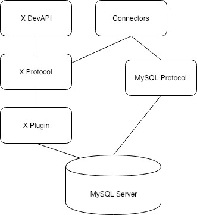

## 前言

今天在查阅 MySQL 文档时，无意间发现 `X DevAPI` 这个词语，进而了解到 `MySQL X` 这个新鲜事物，发现除了 MySQL 官网文档外，其他资料很少有提及到，好奇心驱使我通读了一遍文档，记录在此，做个总结。

<!-- more -->

## 从数据模型讲起

在开始讲 MySQL X 之前，我想先回顾下 **数据库模型** 这个概念。我们通常使用的很多数据库，如 MySQL、PostgreSQL 提供的是 **关系型（relational）模型**，即把数据分为行（row）和列（column）进行组织，通过标准的结构化查询语言（SQL）操作数据。但这种组织形式并不灵活，于是又发展出以 MongoDB 为代表的 **非关系型数据库模型**，或者叫 **文档型（document）模型**，它里面存储的是如 JSON 这样的灵活数据，实时性和扩展性更高。

顺应时代的发展，MySQL 在 5.7 版本后也宣布支持了 JSON 和文档型数据的存储和查询。

## MySQL X 

在 MySQL 支持文档型数据后，官方为了统一两种数据的API，设计了 MySQL X。 X 在英文中有交叉（Cross）的意思，可以这么理解， MySQL X 就是用于交叉操作 MySQL 数据库中这两类数据的一种扩展能力。其包括三部分：

1. X Plugin
2. X protocol
3. X DevAPI

### X plugin

X plugin 在 5.7.12 版本中引入，最初该插件是需要手动安装的，但在 8.0 版本中已经默认安装。这是一个 MySQL 服务器和客户端之间的全新接口。这个新接口的能力包括：

1. 像传统的SQL一样操作关系型数据
2. 操作非关系型的文档对象（document objects）
3. 提供 **异步查询能力**
4. ...

### X protocol

这是 MySQL 服务器和客户端之间通信连接的扩展全新协议。作为一个现代化的协议，当然也是充分考虑到了异步通信的能力。底层是使用 Google 的 protobuf 来进行序列化和反序列化。

相比老协议，在可扩展性、性能以及安全性方面都有提升。

###  X DevAPI

X DevAPI 实际上就是一系列的 API 实现，并提供给开发者使用的。其不仅包括 Shell 客户端，还包括 JavaScript、Python、C#、Java 等编程语言支持（官方称为Connector），其中，对 Java 的支持已经集成在 [Connector/J](https://dev.mysql.com/doc/connector-j/8.1/en/connector-j-using-xdevapi.html) 中。

以 Java 为例，以前我们使用 java 操作数据库都是用 JDBC ，这是一种通用的编程规范， MySQL Connector/J 实现了这个规范，于是我们可以用 JDBC 来操作 MySQL 数据。现在，Connector/J 内置了 X DevAPI 之后，我们也可以使用 X DevAPI 来操作 MySQL 数据 ，完全不再需要 JDBC 了。

从官方文档来看，X DevAPI 也有 Connection、Session、Statement、Result Sets 这些概念，但跟 JDBC 中不完全相同，其 CRUD 语法同时支持传统的关系型表和文档型数据，更厉害的是，如果你用不惯，它也支持直接使用 SQL ，此外，还提供了异步调用的方法。可谓是非常强大了。感兴趣的可以通读一遍 [X DevAPI User Guide](https://dev.mysql.com/doc/x-devapi-userguide/en/)，内容不多，也很容易理解。

---

## 最后

在 percona 看到一篇文章通俗地讲解了 MySQL X，里面有一张图说明了之间的关系，特引用如下：

最后，因为时间有限，暂时没有实际上手感受一下新的API，后续有兴趣了，我会尝试下。

---

## 参考

- [X DevAPI User Guide](https://dev.mysql.com/doc/x-devapi-userguide/en/)
- [Understanding MySQL X (All Flavors)](https://www.percona.com/blog/understanding-mysql-x-all-flavors/)
- [MySQL · 源码阅读 · X-plugin的传输协议](http://mysql.taobao.org/monthly/2021/02/07/)