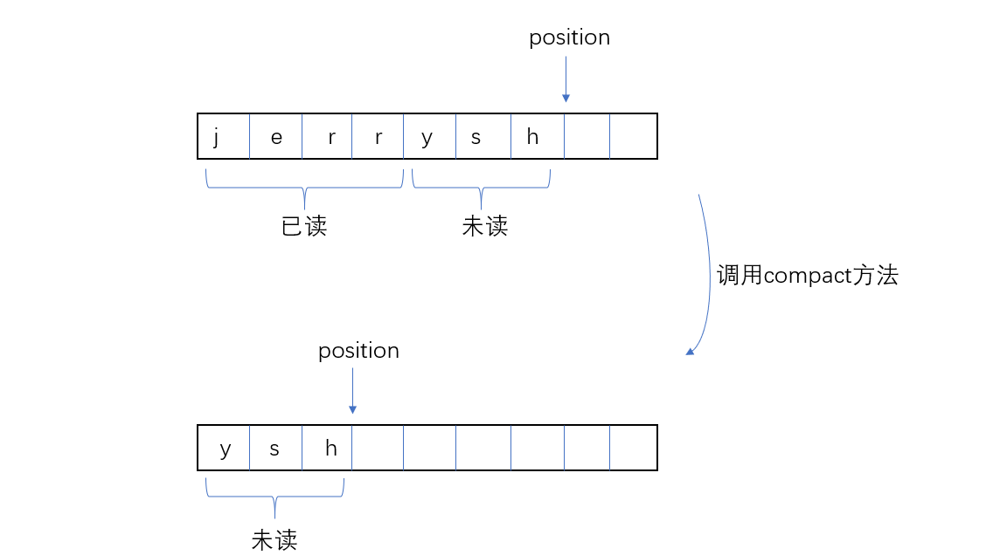
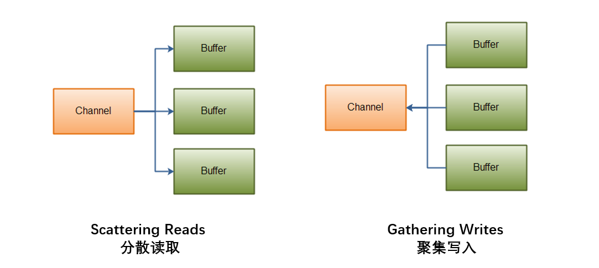

# 什么是 Java NIO

Java NIO， N 可以理解为 New ，也可以理解为 Non-blocking ，是 Java 1.4 之后新的一套区别于标准 Java IO 和 Java Networking 的 API 。

<!-- more -->

## 面向 Channels 和 Buffers

普通的IO，面向的是 byte streams（字节流，如FileOutputStream） 和 character streams（字符流，如FileReader），但是 NIO 面向的是 channels 和 buffers 。对于 Channel 来说，数据总是从 channel 写进 buffer 里，然后 Java 从 buffer 取出使用，或者 channel 读 buffer 里的数据，传输到外界。


Channel 有点像流（Stream），在 Java NIO 中，有以下几种 channel：

- FileChannel
- DatagramChannel （用于通过 UDP 读写数据）
- SocketChannel （用于通过 TCP 读写数据）
- ServerSocketChannel

而 Buffer 就是我们熟悉的缓冲区了。包括：

- ByteBuffer
- CharBuffer
- DoubleBuffer
- FloatBuffer
- IntBuffer
- LongBuffer
- ShortBuffer

> 事实上，还有一个 MappedByteBuffer ，但是这里不展开讲。

## Non-blocking IO

一个线程，可以让 channel 把数据读进 buffer 中（是 buffer 在读不是 channel 在读），当 channel 正在读的时候，线程可以做其他事。一旦数据已经读进 buffer 了，线程可以回来处理这些数据。 写的情况也是类似。


## Selectors
Java NIO 有一个 "selectors" 的概念。 selector 可以监控多个 channels 事件的状态（例如，连接已建立，数据已到达等）。因此，只需一个线程即可管理多个 channels 。


---

# 一个简单的例子

Channel 和 Buffer 配合的工作流程如下：

1. 开一个文件
2. 获取 Channel
3. 设置 buffer
4. 让 Channel 将数据读到 buffer 里
5. 数据进入 buffer
6. 调用 `buffer.flip()`
7. 数据从 buffer 出去
8. 调用 `buffer.clear()` 或 b`uffer.compact()`

```java
// RandomAccessFile 可以自由读写文件的任意位置，不继承字节流或字符流
// 1. 开一个文件
RandomAccessFile aFile = new RandomAccessFile("data/nio-data.txt", "rw");

// 2. 获取 Channel
FileChannel inChannel = aFile.getChannel();

// 3. 设置 buffer，由于我们要读字节，因此是 ByteBuffer
ByteBuffer buf = ByteBuffer.allocate(48);

// 4. 利用 Channel 将数据读到 buffer 里
int bytesRead = inChannel.read(buf);

while (bytesRead != -1) {

    System.out.println("Read " + bytesRead);
    buf.flip();

    while(buf.hasRemaining()){
        System.out.print((char) buf.get());
    }

    buf.clear();
    bytesRead = inChannel.read(buf);
}

aFile.close();
```

注意：

- `buf.flip()` 的作用：当你想从 buffer 里获取数据，应该调用 flip 方法。调用这个方法的时候，buffer 将会从 数据写入模式 切换到 数据读出模式
- `buf.clear()`的作用：当数据全部从 buffer 读出去了，应该调用 clear 或 compact 方法，好让 buffer 重写可以写入。 这两个方法的区别是：clear清除整个缓冲区，compact只清除已经读过的部分。

---

# Capacity, Position 和 Limit

buffer 实际上是一块内存区域可以让你往里面写数据，之后再读到程序里。这块内存区域包含在一个 NIO Buffer 对象里。

在 buffer 中，有 Capacity, Position 和 Limit 这三个概念。position 跟 limit 跟 buffer 是读模式还是写模式有关，而 Capacity 与模式无关。


## Capacity

顾名思义，Capacity 就是容量。也就是 buffer 缓冲区最多能存储多少 bytes （或者 longs，或 chars ，取决于何种类型的 buffer ）

## Position

当你往 buffer 里写一个单位的数据的时候， position 就 +1， position是当前位置指示器。最大值为 Capacity - 1。

当你从 buffer 里读数据时，同样有一个 position 指示器。当调用 flip ，让 buffer 从写模式转换成读模式的时候， position 会被重置为 0

## limit

在 buffer 写模式中， limit 等于 capacity，决定了你能往 buffer 里写多少数据。

在 buffer 读模式中，limit 告诉你缓冲取最多有多少数据可以让你读取。也就是说，一开始写模式写了多少数据，会记录在 position 中，一旦你调用 flip 切换到读模式，limit 就是刚刚的 position。

---

# Buffer 的方法

## flip

当调用 flip方法， position 会被置0，然后 buffer 会切换模式（读->写，或 写->读），limit 也随之改变。

## rewind

rewind 可以让 position 变为 0， 好让你重新读刚刚读过的数据，但是模式不变。limit 的值也不会变。

## clear() 和 compact()

clear清除整个缓冲区，compact只清除已经读过的部分。如果你有一些数据还没读，使用 compact， compact 会把未读的数据放到起始位置，然后把 position 放到最后一个数据的右边。




## mark() 和 reset()

可以用 mark 方法标记 position，然后做一个其他事后，调用 reset， position 会回到刚刚标记的位置。


---


# Scatter（分散） / Gather（聚集）

channel "scatters" 是指，多个 buffer 从一个 Channel 里读取数据。

channel "gathers" 是指，多个 buffer 把数据写进一个 Channel。



---

未完待续


---

# 什么时候用 NIO，什么时候用传统 IO ？

NIO可以只使用一个（或几个）单线程管理多个通道（网络连接或文件），但付出的代价是解析数据可能会比从一个阻塞流中读取数据更复杂。

如果需要管理同时打开的成千上万个连接，这些连接每次只是发送少量的数据，例如聊天服务器，实现NIO的服务器可能是一个优势。同样，如果你需要维持许多打开的连接到其他计算机上，如P2P网络中，使用一个单独的线程来管理你所有出站连接，NIO可能是一个优势。

如果你只有少量的连接但是每个连接都占有很高的带宽，同时发送很多数据，传统的IO会更适合。
